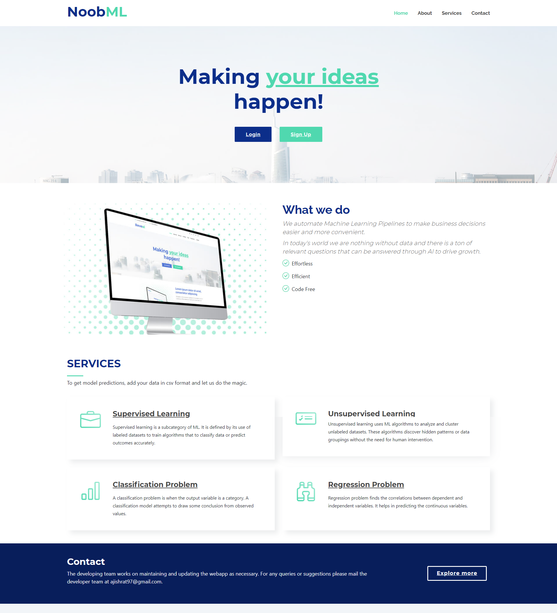

# NoobML
A digital Platform automating Machine Learning Pipeline.  
` Note: The project is still under developement and will be updated soon.`
 

<!-- TABLE OF CONTENTS -->
## Table of Contents

* [About The Project](#about-the-project)
* [Architecture](#architecture)
* [Installations](#installations)

## About The Project
NoobML is a django web app that allows simple machine learning tasks to be carried out even for the most novice users. The highlight of the project is eliminating the use of code. User can just plug in their dataset and within minutes get predictions and answers to many business questions. We all know how powerful data can be and this is just a stepping stone to elevate business decision making process.    
  &ensp;&ensp;&ensp;
  &ensp;&ensp;&ensp;
  &ensp;&ensp;&ensp;
  &ensp;&ensp;&ensp;
  &ensp;&ensp;&ensp;

## Architecture

The web app is developed in **python** using **Django framework**. Most of the logic is written in python with the help of numerous machine learning libraries such as  **pandas, numpy, matplotlib**. At the core of the project, **Pytorch** was used for training the model.
Some of the models available include:
 * Logistic Regression
 * Random Forest
 * SVM
 * Decision Tree
 * K Means Clustering

## Installations
* Make sure you have python3 installed
* Create a virtual environment
* Source the virtual environment
* Run `pip install -r requirements.txt`
* `cd` to `code/NoobML`
* Run `python manage.py runserver --noreload --nothreading`
* Go to `http://127.0.0.1:8000/read/` (port may be different)

